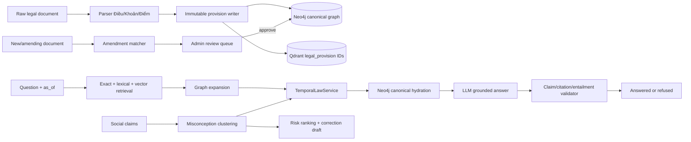

# Kế hoạch triển khai lõi LAWGIC cho CMC LexSocial AI

**Trạng thái:** Proposed  
**Ngày lập:** 2026-07-19  
**Phạm vi:** Nâng lõi dữ liệu pháp lý, temporal reasoning, citation, amendment matching, social misconception và evaluation; giữ nguyên FastAPI, Neo4j, Qdrant, PostgreSQL, Redis, MinIO và hai portal hiện có.

## 1. Kết quả cần đạt

Sau đợt triển khai này, CMC phải chứng minh được sáu năng lực bằng test và demo:

1. Ingest bảo toàn đầy đủ cây `Điều → Khoản → Điểm`; không làm mất `Điểm` giữa parser và Neo4j.
2. Mỗi phiên bản quy định là bất biến, có khoảng hiệu lực riêng và nối lịch sử bằng `SUPERSEDED_BY`.
3. `law_as_of(date)` trả đúng node lá sâu nhất đang có hiệu lực: `Điểm`, hoặc `Khoản` không có Điểm, hoặc `Điều` không có Khoản.
4. QA chỉ dùng quy định hợp lệ tại ngày hỏi, citation tới đúng node, quote khớp nguyên văn và từng claim được citation hỗ trợ.
5. Claim trên mạng xã hội có thể được phân loại là thông tin lỗi thời từng đúng trước đây, gom thành `Misconception` và liên kết cả phiên bản cũ lẫn hiện hành.
6. Mọi tuyên bố chất lượng đều có gold set, baseline, metric và báo cáo tái lập được.

Ba demo nghiệm thu bắt buộc:

- Cùng một câu hỏi ở `2026-06-30` và `2026-07-01` trả hai căn cứ khác nhau.
- Một claim dùng ngưỡng cũ được gắn `OUTDATED_BUT_PREVIOUSLY_TRUE`, chỉ ra phiên bản cũ và phiên bản hiện hành.
- Một câu hỏi không có căn cứ hoặc citation không hỗ trợ claim bị từ chối, không trả câu trả lời pháp lý “unverified”.

## 2. Baseline đã kiểm chứng

| Khu vực | Hiện trạng trong code | Gap cần xử lý |
|---|---|---|
| Parser | `LegalParser` nhận diện `diem_list` | `_build_tree()` bỏ `diem_list`; `upsert_van_ban()` không ghi `Diem` |
| Hiệu lực | `ngay_hieu_luc` nằm trên `VanBanPhapLuat` | QA lọc thay thế ở cấp toàn văn bản, sai với sửa đổi một phần |
| Citation | Có exact quote validation và NLI faithfulness | Contract chỉ có `khoan_id`; validator có thể tin text preloaded từ Qdrant thay vì luôn hydrate từ Neo4j |
| Retrieval | Qdrant + fallback `CONTAINS` Neo4j | Chỉ index/retrieve `Khoan`; chưa có lexical fusion, graph expansion và node lá |
| Diff | Token diff bằng `difflib` | Chưa ghép phiên bản, chưa phân loại tác động, chưa đóng hiệu lực hoặc ghi `SUPERSEDED_BY` |
| Social | `BaiDang → YKien → DOI_CHIEU → Khoan` và Alert | Chưa có `Misconception`, velocity, engagement hoặc liên kết với phiên bản cũ |
| Evaluation | 20 citation, 20 link, 20 NLI; script báo `precision@5=0.80`, `nli_accuracy=1.00` | Gold hiện sinh từ seed, chưa đo parser, temporal, amendment, QA exact node hoặc refusal |
| Test/build | Backend `89 passed`; frontend production build pass | Chưa có integration test Neo4j cho temporal graph và CI deploy gate |

Lưu ý dữ liệu: các văn bản ingest bằng pipeline hiện tại đã mất nội dung `Điểm` sau bước parse. Migration không được tự dựng lại nội dung bị mất; phải re-ingest từ raw file/MinIO sau khi pipeline v2 sẵn sàng.

## 3. Các quyết định kiến trúc

### ADR-001 — Một contract `LegalProvision`, giữ nguyên label Neo4j hiện có

Giữ `Dieu`, `Khoan`, `Diem` để tránh rewrite toàn hệ thống. Backend dùng một model chung:

```python
class LegalProvision(BaseModel):
    provision_id: str
    level: Literal["dieu", "khoan", "diem"]
    lineage_id: str
    version_no: int

    source_vb_id: str
    logical_vb_id: str
    dieu_so: str
    khoan_so: str | None
    diem_ky_hieu: str | None

    text: str
    effective_from: date
    effective_to: date | None

    text_checksum: str
    source_checksum: str | None
    visibility: Literal["public", "internal"]
```

Quy ước:

- `provision_id` định danh một phiên bản vật lý; dùng lại `dieu_id`, `khoan_id`, `diem_id` hiện có.
- `lineage_id` gom các phiên bản của cùng một quy định qua thời gian.
- `effective_to` là mốc loại trừ: node có hiệu lực khi `from <= as_of < to`.
- `source_vb_id` là văn bản tạo ra nội dung; `logical_vb_id` là văn bản đang được hợp nhất/sửa đổi. Với văn bản bình thường, hai giá trị giống nhau.
- `status` của quy định được suy ra từ ngày, không lưu thêm một field dễ lệch.

Không thêm một label Neo4j chung ở giai đoạn đầu. Repository dùng ba nhánh query/`UNION` để các index theo label vẫn hoạt động và graph explorer không xuất hiện label phụ.

### ADR-002 — Node bất biến và node lá sâu nhất giữ sự thật

- Không `SET noi_dung` lên một node đã tồn tại nếu `text_checksum` thay đổi.
- Re-ingest cùng checksum là idempotent.
- Cùng `provision_id` nhưng checksum khác phải tạo conflict `needs_review`, không ghi đè.
- Khi có sửa đổi: tạo node mới, đóng `effective_to` node cũ, nối `SUPERSEDED_BY`.
- Citation và `law_as_of` chọn:
  - `Diem` nếu `Khoan` có Điểm;
  - `Khoan` nếu không có Điểm;
  - `Dieu` nếu không có Khoản.

Text dùng cho retrieval có thể ghép tiêu đề Điều + phần dẫn Khoản + nội dung Điểm, nhưng canonical quote phải khớp đúng text của node được trích. Nếu một claim đồng thời dựa vào phần dẫn của Khoản và hành vi ở Điểm, claim phải có hai citation.

### ADR-003 — Neo4j là source of truth; Qdrant chỉ trả candidate ID

Tạo collection mới `legal_provision` thay vì sửa trực tiếp `khoan`:

```json
{
  "provision_id": "108-2025-QH15::D5.K2.Pa",
  "level": "diem",
  "source_vb_id": "...",
  "logical_vb_id": "...",
  "lineage_id": "...",
  "effective_from": "2026-07-01",
  "effective_to": null,
  "visibility": "public",
  "text_checksum": "..."
}
```

Qdrant có thể giữ `text_preview` để debug nhưng QA không được dùng payload đó làm canonical source. Sau retrieval, backend batch-hydrate các ID từ Neo4j, áp temporal filter rồi mới đưa context cho LLM.

Giữ collection `khoan` trong một release để rollback. Pipeline dual-write trong thời gian chuyển đổi.

### ADR-004 — Citation Contract v2 và strict grounding

Response mới:

```json
{
  "status": "answered",
  "answer": "Từ ngày 01/07/2026, ngưỡng là ...",
  "as_of": "2026-07-01",
  "claims": [
    {
      "claim_id": "claim_1",
      "text": "Ngưỡng mới là ...",
      "citation_ids": ["citation_1"],
      "support_status": "entailed"
    }
  ],
  "citations": [
    {
      "citation_id": "citation_1",
      "node_id": "108-2025-QH15::D5.K2.Pa",
      "level": "diem",
      "document_number": "108/2025/QH15",
      "article": "5",
      "clause": "2",
      "point": "a",
      "quote": "Nguyên văn...",
      "effective_from": "2026-07-01",
      "effective_to": null,
      "source_checksum": "...",
      "supports_claim_ids": ["claim_1"],
      "entailment_score": 0.94
    }
  ]
}
```

Strict mode là mặc định cho Citizen:

- Không có candidate hợp lệ → `status=refused`.
- Node không có hiệu lực tại `as_of` → loại.
- Quote không khớp Neo4j → loại.
- Citation không hỗ trợ claim → loại claim hoặc từ chối toàn câu trả lời nếu claim đó là kết luận chính.
- Không còn citation → từ chối; không trả hướng dẫn pháp lý nguyên tắc dưới nhãn `unverified`.

Admin có thể giữ “guidance mode” bằng feature flag riêng, nhưng UI phải ghi rõ không phải câu trả lời có căn cứ và không cho publish/copy như nội dung đã xác minh.

Trong giai đoạn tương thích, API vẫn trả `khoan_id` như alias deprecated cho client cũ; frontend mới dùng `node_id`, `level`, `point`.

### ADR-005 — Amendment engine là deterministic-first, human-reviewed

Thứ tự ghép node:

1. Dẫn chiếu sửa đổi tường minh: Điều/Khoản/Điểm đích.
2. Ghép Điều theo số + tiêu đề.
3. Ghép node cùng vị trí trong Điều đã ghép, nhưng bắt buộc vượt ngưỡng text/entity similarity.
4. Ghép lại phần còn dư bằng lexical + embedding + entity overlap + cross-reference overlap.
5. Không đoán cặp ở vùng xám.

Phân loại:

`UNCHANGED | REWORDED | TIGHTENED | LOOSENED | ADDED | REMOVED | SPLIT | MERGED | UNCERTAIN`

Mức tự động:

- `confidence >= 0.90`, không phải split/merge → có thể auto-approve sau khi metric pairing precision đạt gate.
- `0.70 <= confidence < 0.90` → Admin review.
- `< 0.70`, `SPLIT`, `MERGED`, target không rõ → bắt buộc review, không ghi temporal edge.

V1 chỉ auto-commit khi amendment cung cấp nội dung thay thế hoàn chỉnh. Dẫn chiếu mơ hồ, sửa nhiều tầng hoặc không thể dựng consolidated text phải dừng ở review queue.

### ADR-006 — Misconception là cụm claim, không phải phán quyết tuyệt đối

Giữ nhãn đạo đức hiện có `khop | mau_thuan | khong_ro`, bổ sung lý do temporal:

`CURRENTLY_SUPPORTED | OUTDATED_BUT_PREVIOUSLY_TRUE | NEVER_SUPPORTED | PARTIALLY_SUPPORTED | UNVERIFIABLE`

Quan hệ:

```text
(YKien)-[:INSTANCE_OF]->(Misconception)
(Misconception)-[:CONTRADICTS]->(Diem|Khoan|Dieu hiện hành)
(Misconception)-[:BASED_ON_OUTDATED_VERSION]->(Diem|Khoan|Dieu cũ)
(DeXuatDinhChinh)-[:CORRECTS]->(Misconception)
```

Risk score phải lưu cả tổng điểm và thành phần giải thích; không chỉ lưu `severity`.

## 4. Kiến trúc đích



`TemporalLawService` là cổng duy nhất cho hiệu lực. `qa_service.py`, social claim check, diff UI và Citizen legal API không được tự viết logic ngày riêng.

## 5. Kế hoạch theo milestone và PR

### Milestone 0 — Contract và fixture khóa hành vi

**Thời lượng:** 2–3 ngày, chạy song song DB + BE1 + BE3.

#### PR 0.1 — Ontology v2 và contract

- Nâng `Data/schema/ontology.json` lên `2.0.0`.
- Thêm property temporal/version/checksum cho `Dieu`, `Khoan`, `Diem`.
- Thêm `SUPERSEDED_BY`, `INSTANCE_OF`, `CONTRADICTS`, `BASED_ON_OUTDATED_VERSION`.
- Tạo `Backend/domain/legal_provision.py` và `Backend/domain/citation_contract.py`.
- Viết ADR chính thức trong `docs/architecture/`.

#### PR 0.2 — Temporal fixtures

Tạo fixture gồm:

- Version 1 có `Điểm a`, `Điểm b`.
- Version 2 chỉ sửa `Điểm a` từ `2026-07-01`; `Điểm b` vẫn sống.
- Version 3 sửa tiếp `Điểm a`.
- Một Khoản không có Điểm.
- Một Điều không có Khoản.
- Một trường hợp future-effective và một trường hợp repealed.

**Exit gate:** contract được chốt; expected IDs cho từng ngày được ghi cố định trước khi viết service.

### Milestone 1 — Ingest và persistence không làm mất Điểm

**Thời lượng:** 4–6 ngày.

#### PR 1.1 — Bảo toàn parser tree

Sửa:

- `Backend/app/pipelines/legal/pipeline.py::_build_tree`
- `Backend/app/pipelines/legal/parser.py`
- ID generator trong `Backend/app/pipelines/legal/normalize.py`

Yêu cầu:

- Giữ `diem_list`, sinh `diem_id`.
- Giữ text Điều khi Điều không có Khoản.
- Không tạo synthetic Khoản nếu việc đó làm sai cấu trúc nguồn; nếu cần compatibility thì đánh dấu `synthetic=true`.
- Tính `text_checksum` cho từng node.
- Test parser cho multiline, Khoản có/không Điểm, Điều có/không Khoản.

#### PR 1.2 — Neo4j writer v2

Sửa `Backend/app/adapters/neo4j_legal.py`:

- Ghi đủ `Dieu`, `Khoan`, `Diem` và `CO_DIEM`.
- Backfill `effective_from` từ văn bản khi chưa có ngày riêng.
- Chặn mutation khi checksum khác.
- Dùng một transaction cho một cây văn bản.
- Trả count theo cả ba tầng và danh sách conflict.

Schema:

- Index `(effective_from, effective_to)` cho từng label.
- Index `lineage_id`, `logical_vb_id`, `text_checksum`.
- Constraint/validation ứng dụng cho khoảng ngày và checksum.

#### PR 1.3 — Qdrant collection v2 và dual-write

- Thêm `legal_provision` vào `Data/schema/qdrant/collections.json`.
- Sửa indexing để index node lá, không chỉ Khoản.
- Payload chỉ mang metadata; canonical hydration luôn từ Neo4j.
- Thêm script `Backend/scripts/reindex_legal_provisions.py`.

#### PR 1.4 — Migration/backfill

Tạo `Backend/scripts/migrate_temporal_v2.py`:

- `--dry-run`: báo count, node thiếu ngày, thiếu raw source, checksum conflict.
- `--apply`: additive backfill; không xóa field/node cũ.
- Danh sách văn bản cần re-ingest vì mất Điểm.
- Idempotent và ghi migration report.

**Exit gate:** parser fixture round-trip giữ 100% node/text; re-ingest hai lần không nhân đôi; checksum conflict bị chặn.

### Milestone 2 — Temporal kernel và API

**Thời lượng:** 4–5 ngày.

#### PR 2.1 — Repository và service

Tạo:

- `Backend/app/adapters/neo4j_temporal.py`
- `Backend/app/services/temporal_law_service.py`

Interface:

```python
law_as_of(as_of, *, logical_vb_id=None, topic=None, ids=None)
get_provision(provision_id, *, as_of=None)
resolve_version(provision_id, as_of)
timeline(provision_id)
compare_versions(old_id, new_id)
hydrate_candidates(ids, as_of, audience)
```

Invariants:

- Không trả node cha nếu có node con hợp lệ trong cùng cấu trúc.
- Không có cycle `SUPERSEDED_BY`.
- Edge cutover trùng `old.effective_to` và `new.effective_from`.
- Node future/repealed không lọt vào prompt.

#### PR 2.2 — API

Thêm:

- `GET /admin/legal/provisions/{id}/timeline`
- `GET /admin/legal/documents/{id}/as-of?date=...`
- `GET /citizen/legal/provisions/{id}?as_of=...`
- `GET /admin/legal/documents/{old_id}/compare/{new_id}`

Giữ endpoint Khoản cũ trong một release và map qua service mới.

#### PR 2.3 — QA integration

Refactor `Backend/app/services/qa_service.py`:

- Xóa temporal Cypher riêng ở cấp văn bản.
- Retrieval trả ID → `hydrate_candidates()` → temporal filter → prompt.
- Cache key thêm `temporal_graph_revision`.
- `notices` lấy từ timeline thật, không chỉ `THAY_THE` giữa văn bản.

**Exit gate:** partial-amendment, three-version chain, future/repealed và deepest-leaf acceptance tests đều pass.

### Milestone 3 — Retrieval và Citation Contract v2

**Thời lượng:** 5–7 ngày.

#### PR 3.1 — Hybrid legal retrieval

Tạo `Backend/app/services/legal_retrieval_service.py`:

1. Exact legal reference lookup.
2. Neo4j full-text/BM25-like lexical lookup trên `Dieu`, `Khoan`, `Diem`.
3. Qdrant vector lookup trên `legal_provision`.
4. Reciprocal-rank fusion hoặc weighted fusion cấu hình được.
5. Graph expansion qua `SUPERSEDED_BY`, `SUA_DOI`, `THAY_THE`, `LIEN_QUAN`, `CAN_CU`.
6. Temporal hydration/filter.
7. Rerank.

Không đóng cứng trọng số trước khi có gold benchmark. Chạy baseline:

`lexical | vector | lexical+vector | +graph | +reranker`.

#### PR 3.2 — Canonical citation validator

Sửa `Backend/app/services/citation_validator.py`:

- Batch-fetch canonical node từ Neo4j theo `node_id`.
- Không nhận Qdrant text làm bằng chứng canonical.
- Kiểm tra node tồn tại, visibility, effective interval, checksum, exact quote.
- Trả reason code ổn định thay cho chỉ chuỗi lỗi.

#### PR 3.3 — Claim-level support

- Tách answer thành claim có ID.
- Buộc LLM map citation ID cho từng claim.
- Chạy NLI theo đúng cặp claim–citation, không so mọi claim với toàn bộ citation chung.
- Numeric/legal-reference claim không supported → hard fail.
- Citizen strict mode mặc định bật.

#### PR 3.4 — Frontend citation v2

Sửa:

- `Frontend/packages/ui-legal/src/components/CitationCard.tsx`
- `Frontend/packages/ui-legal/src/components/KhoanViewer.tsx`
- Citizen/Admin QA pages

Hiển thị `Điểm`, khoảng hiệu lực, `as_of`, nút timeline và nguyên văn. Không parse Điều/Khoản từ chuỗi ID nếu API đã cung cấp field cấu trúc.

**Exit gate:** 100% citation trong acceptance fixture tồn tại, quote exact, hiệu lực đúng ngày; không còn citation → strict refusal.

### Milestone 4 — Amendment engine và Admin review

**Thời lượng:** 6–8 ngày.

#### PR 4.1 — Matcher/classifier

Tạo:

- `Backend/app/pipelines/legal/amendment_parser.py`
- `Backend/app/pipelines/legal/amendment_matcher.py`
- `Backend/app/pipelines/legal/change_classifier.py`

Nâng `version_diff.py` thành facade gọi ba module này. Tách:

- pairing;
- classification;
- graph commit.

Không để dry-run diff làm thay đổi graph.

#### PR 4.2 — Review persistence

Tạo `Data/schema/postgres/011_amendment_reviews.sql`:

- `amendment_batches`
- `amendment_candidates`
- old/new ID, score components, change type, proposed dates, status, reviewer, note, timestamps.

API:

- `POST /admin/legal/amendments/preview`
- `GET /admin/legal/amendments/reviews`
- `PATCH /admin/legal/amendments/reviews/{id}`
- `POST /admin/legal/amendments/{batch_id}/commit`

Commit phải transactional/idempotent và chỉ nhận candidate approved.

#### PR 4.3 — Admin UI

Tạo:

- `Frontend/apps/web/src/admin/features/amendment-review/`
- `LegalTimeline.tsx`
- `ProvisionDiff.tsx`

Reviewer phải thấy old/new text, score breakdown, extracted numbers/entities, ngày cutover và tác động. Cho phép đổi cặp, loại thay đổi và ngày trước khi approve.

**Exit gate:** auto-approved pairing đạt precision mục tiêu trên gold; split/merge/uncertain không tự commit; rollback bằng feature flag không xóa edge cũ.

### Milestone 5 — Temporal misconception intelligence

**Thời lượng:** 5–7 ngày.

#### PR 5.1 — Social contract

- Bổ sung `engagement`, `parent_external_id` cho `SocialPost`.
- Tạo `Misconception` schema và constraints.
- Đổi link target từ chỉ `Khoan` sang `LegalProvision`.
- Thêm temporal verdict reason.

#### PR 5.2 — Clustering và outdated detector

Tạo `Backend/app/services/misconception_service.py`:

- Cluster claim theo semantic similarity + topic + thời gian.
- So claim với cả phiên bản tại thời điểm post và phiên bản hiện hành.
- Gắn `OUTDATED_BUT_PREVIOUSLY_TRUE` khi claim được phiên bản cũ hỗ trợ nhưng hiện không còn đúng.
- Lưu provenance cho từng instance.

#### PR 5.3 — Risk score

Risk score gồm:

- volume;
- velocity;
- engagement;
- legal impact;
- contradiction confidence;
- recency của thay đổi.

API/UI phải trả breakdown giải thích được. Không gán severity từ volume duy nhất như hiện tại.

**Exit gate:** demo claim ngưỡng cũ tạo đúng cluster, đúng hai edge cũ/mới và correction draft dùng citation v2.

### Milestone 6 — Evaluation, CI và demo

**Thời lượng:** 4–6 ngày; chuẩn bị gold set bắt đầu từ Milestone 0.

Tạo:

```text
eval/
  parser/
  entities/
  retrieval/
  amendment/
  temporal/
  qa/
  misinformation/
  safety/
  reports/
```

Metrics bắt buộc:

| Module | Metric |
|---|---|
| Parser | Recall Điều/Khoản/Điểm, character coverage, invariant errors |
| Retrieval | Recall@1/5, MRR, nDCG, ablation theo từng cấu hình |
| Amendment | Pairing precision/recall, change-type F1, review rate |
| Temporal | Exact active-node accuracy theo ngày |
| QA | Answer correctness, citation exact-node accuracy |
| Faithfulness | Claim–citation entailment precision/recall |
| Safety | Unsupported/off-topic/injection refusal rate |
| Social | Verdict F1, cluster purity/NMI, outdated-verdict F1 |
| Risk | Precision@K cho alert high-risk |
| System | P50/P95 latency, failure rate, token/call cost |

CI mới:

- Backend unit tests.
- Neo4j integration/acceptance tests bằng service container.
- Frontend build.
- Eval smoke set.
- Schema invariant check.
- Không deploy nếu temporal/citation/safety guardrail giảm.

## 6. Acceptance test catalog

| ID | Tình huống | Kết quả bắt buộc |
|---|---|---|
| T01 | Parser gặp Khoản có Điểm a/b | Neo4j có đủ hai `Diem`, text không mất |
| T02 | Khoản có Điểm | Leaf selector chỉ trả các Điểm |
| T03 | Khoản không Điểm | Leaf selector trả Khoản |
| T04 | Điều không Khoản | Leaf selector trả Điều |
| T05 | Điểm a sửa, Điểm b giữ nguyên | Trước/sau cutover chỉ Điểm a đổi |
| T06 | V1 → V2 → V3 | `timeline()` đúng thứ tự, không cycle |
| T07 | Future effective | Không xuất hiện trước ngày hiệu lực |
| T08 | Re-ingest cùng checksum | Không thêm node/edge |
| T09 | Re-ingest khác text cùng ID | `needs_review`, không overwrite |
| T10 | Qdrant payload bị sửa text | Citation vẫn dùng Neo4j và phát hiện mismatch |
| T11 | Citation node không tồn tại | Bị loại |
| T12 | Citation tồn tại nhưng hết hiệu lực | Bị loại tại `as_of` |
| T13 | Quote đúng nhưng không support claim | Claim fail entailment |
| T14 | Không còn citation | Citizen trả `refused` |
| T15 | Auto amendment confidence cao | Commit edge + đóng interval trong một transaction |
| T16 | Split/merge/uncertain | Vào review, không auto-commit |
| T17 | Claim từng đúng ở V1, sai ở V2 | `OUTDATED_BUT_PREVIOUSLY_TRUE` |
| T18 | Claim chưa từng có căn cứ | Không gắn `previously_true` |

## 7. Release gates đề xuất

Guardrail bắt buộc trên fixture/gold:

- Temporal exact-node accuracy: `100%`.
- Graph/citation invariant errors: `0`.
- Citation node existence + exact quote + effectivity: `100%`.
- No-basis, fabricated-node và prompt-injection refusal: `100%`.
- Auto-approved amendment pairing precision: `>= 95%`; nếu chưa đạt thì hạ ngưỡng tự động và chuyển thêm case sang review.

Quality target sau khi có baseline độc lập:

- Parser recall Điều/Khoản/Điểm: `>= 98%` trên bộ văn bản demo.
- Retrieval recall@5: `>= 85%` và cao hơn vector-only có ý nghĩa.
- Citation exact-node accuracy: `>= 85%`.
- Answer correctness: `>= 80%`.
- Outdated-verdict F1: `>= 80%`.

Các target chất lượng là mục tiêu release, không phải kết quả hiện tại. Báo cáo phải công bố cả số không đạt và error analysis.

## 8. Rollout và rollback

Feature flags:

```text
LEGAL_PROVISION_V2_WRITE=true
LEGAL_PROVISION_V2_READ=false
TEMPORAL_V2=false
QA_STRICT_GROUNDING=true
AMENDMENT_ENGINE_V2=false
MISCONCEPTION_V2=false
```

Trình tự:

1. Snapshot Neo4j/Postgres/Qdrant.
2. Apply schema/index additive.
3. Bật dual-write, vẫn read collection `khoan`.
4. Chạy migration dry-run và lưu report.
5. Re-ingest raw documents để phục hồi Điểm.
6. Backfill `legal_provision`.
7. Shadow-read v1/v2, so node count/citation/latency.
8. Bật `TEMPORAL_V2`, sau đó `LEGAL_PROVISION_V2_READ`.
9. Bật amendment/social theo từng module.
10. Chỉ bỏ compatibility field/collection sau ít nhất một release ổn định.

Rollback chỉ tắt read flag; không xóa node, edge hay collection cũ trong cùng release.

## 9. Phân công và lịch khả thi

Giả định đội hình: 3 backend, 1 frontend, 1 data.

| Tuần | DB | BE1 | BE2 | BE3 | FE |
|---|---|---|---|---|---|
| 1 | Ontology/index/migration | Parser + Điểm + immutable writer | Chuẩn bị retrieval/eval gold | Contract + temporal fixture | Citation/timeline contract |
| 2 | Backfill + integration DB | Amendment parser/matcher | Hybrid retrieval | Temporal service + QA integration | Citation v2 + timeline skeleton |
| 3 | Review tables + audit | Change classifier | Misconception clustering | Citation validator + amendment API | Amendment review + diff |
| 4 | Acceptance DB + snapshot | Error analysis | Risk/eval | CI + strict refusal | Demo polish |
| 5 buffer | Data repair | Pairing tuning | Gold expansion | Regression/performance | Accessibility/build |

Ước lượng tổng: 25–35 person-days, khoảng 4 tuần với 5 người và một tuần buffer. Critical path:

`contract → ingest giữ Điểm → temporal service → strict citation → amendment commit → outdated misconception → eval/demo`.

## 10. Definition of Done

Đợt nâng cấp chỉ hoàn thành khi:

- Các acceptance test T01–T18 pass trên CI có Neo4j thật.
- Không còn temporal logic cấp văn bản trong `qa_service.py`.
- Qdrant không thể trở thành canonical citation source.
- Citizen strict mode không trả legal answer thiếu citation hợp lệ.
- Migration có dry-run report, snapshot và rollback bằng flag.
- UI thể hiện được Điểm, ngày hiệu lực, timeline và diff tác động.
- Evaluation report có baseline, ablation, metric và limitations.
- Hai câu hỏi trước/sau `01/07/2026` cùng claim lỗi thời chạy được end-to-end trong demo cố định.

## 11. Việc nên bắt đầu ngay

PR đầu tiên nên giới hạn ở Milestone 0 + PR 1.1:

1. Thêm contract `LegalProvision`.
2. Tạo fixture sửa đổi một phần.
3. Sửa `_build_tree()` giữ `diem_list` và sinh `diem_id`.
4. Viết test chứng minh parser → tree không mất Điểm.

Đây là lát cắt nhỏ nhất mở khóa toàn bộ temporal graph mà chưa thay đổi API hoặc dữ liệu production.

---

> Roadmap này là phân tích nền. Tài liệu thực thi hiện hành: `lawgic-core-execution-plan-v2.md`.
